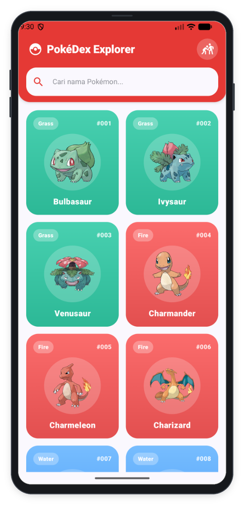
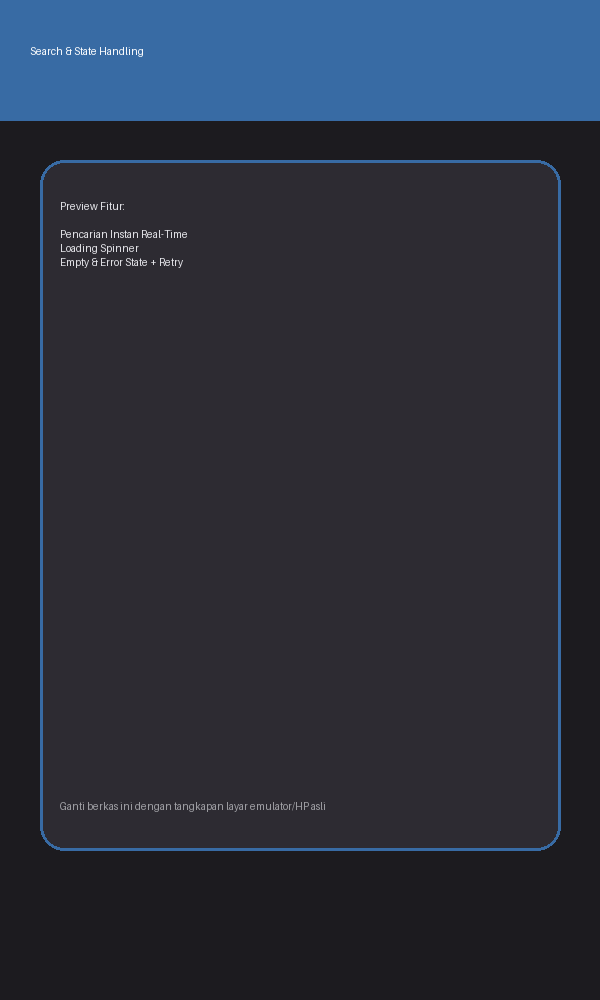
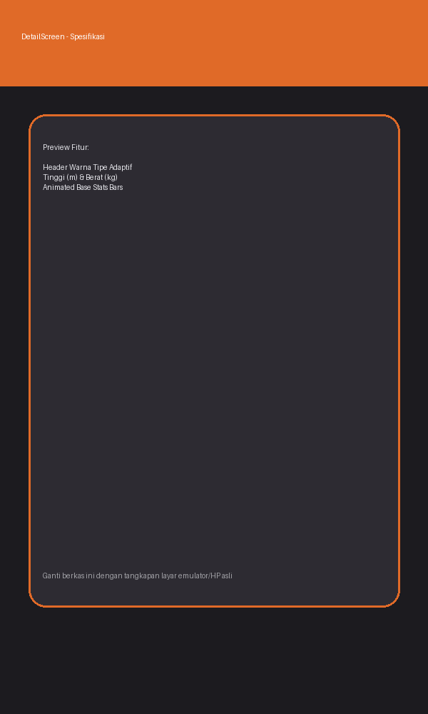
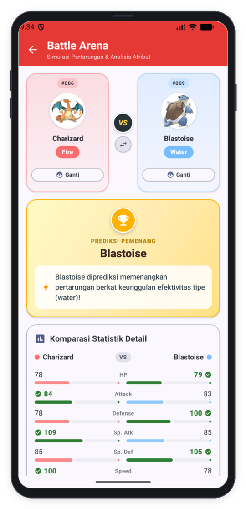

<div align="center">


# PokéDex Explorer: Catalog & Battle Arena
> Aplikasi Katalog Pokémon Dinamis, Eksplorasi Atribut, dan Simulasi Pertarungan Modern berbasis Android dengan Jetpack Compose Material 3, PokéAPI REST, dan Arsitektur MVVM.

[](https://github.com/iqsanazhr/H1D024009_ResponsiMobile_ShiftC)
[](https://developer.android.com)
[](https://kotlinlang.org)

[](https://developer.android.com/jetpack/compose)
[](https://pokeapi.co)
[](https://square.github.io/retrofit/)

[](https://developer.android.com/topic/architecture)
[](https://github.com/iqsanazhr)
[](LICENSE)

</div>

## Identitas Praktikan
- **Nama Lengkap:** Iqsan Azhar Nuryadi
- **NIM:** H1D024009
- **Shift Awal:** Shift C
- **Shift Akhir:** Shift C
- **Link Video Demo/Penjelasan:** [YouTube/Google Drive](https://...)

---

## Deskripsi Aplikasi
**PokéDex Explorer** adalah aplikasi mobile Android modern yang dikembangkan untuk memfasilitasi pencarian, katalogisasi, dan eksplorasi data Pokémon secara dinamis langsung dari [PokéAPI](https://pokeapi.co/).

Aplikasi ini mengatasi kendala pengguna dalam mencari dan memahami atribut Pokémon (seperti nama, tipe elemen, tinggi, berat, kemampuan/abilities, dan visualisasi bar statistik dasar seperti HP, Attack, Defense, Sp. Atk, Sp. Def, dan Speed). Dengan antarmuka berbasis **Jetpack Compose Material 3**, aplikasi ini menyajikan pengalaman interaktif yang responsif, visual official artwork berkualitas tinggi, serta navigasi yang mulus berlandaskan arsitektur **MVVM (Model-View-ViewModel)**.

---

## Penjelasan Teknis

### 1. Spesifikasi & Tech Stack
- **Bahasa:** Kotlin 2.0.21
- **UI Framework:** Jetpack Compose (Material Design 3)
- **Min SDK:** 29 (Android 10.0) | **Target SDK:** 36 (Android 16)
- **Pola Arsitektur:** MVVM (Model-View-ViewModel) murni
- **Library Utama:**
  - `Navigation Compose` (`androidx.navigation:navigation-compose:2.8.5`): Pengelolaan rute navigasi antar layar (Home & Detail) secara type-safe.
  - `ViewModel` & `StateFlow` (`androidx.lifecycle:lifecycle-viewmodel-compose:2.8.7`): State-driven UI reaktif dan pengelolaan lifecycle data secara terpisah dari composable.
  - `Retrofit 2` & `Gson Converter` (`com.squareup.retrofit2:2.11.0`): Komunikasi jaringan HTTP ke PokéAPI REST service.
  - `OkHttp Logging Interceptor` (`com.squareup.okhttp3:4.12.0`): Logging request dan response jaringan untuk pemantauan API.
  - `Coil Compose` (`io.coil-kt:coil-compose:2.7.0`): Pemuatan gambar official artwork Pokémon secara asinkron dengan caching dan crossfade transition.
  - `Kotlin Coroutines`: Pemrosesan asinkron non-blocking di background thread (`Dispatchers.IO`).

### 2. Fitur Utama
- **Ikon Aplikasi Resmi Pokéball (Adaptive Icon):** Ikon peluncur (*launcher icon*) aplikasi dikustomisasi menggunakan desain vektor Pokéball resmi yang presisi serta mendukung format Adaptive Icon dan seluruh densitas resolusi layar Android (mdpi hingga xxxhdpi).
- **Katalog Pokémon Dinamis & Pewarnaan Berbasis Atribut:** Menampilkan kumpulan kartu Pokémon dengan nomor indeks resmi (`#001`), gambar official artwork beresolusi tinggi, nama Pokémon, serta **warna latar belakang kartu dan kotak gambar yang otomatis beradaptasi dengan tipe atribut elemen Pokémon** (seperti hijau untuk Rumput/Grass, oranye untuk Api/Fire, biru untuk Air/Water, kuning untuk Listrik/Electric, dll).
- **Pencarian Real-Time (Search Functionality):** Memfilter Pokémon secara instan berdasarkan nama atau nomor ID melalui input `PokemonSearchBar`. Dilengkapi state pencarian kosong (*Empty State*) jika nama yang dicari tidak ditemukan.
- **Manajemen Multi-State UI Komprehensif:** Mendukung transisi UI berbasis status (State-Driven):
  - *Loading State*: Menampilkan animasi spinner saat mengunduh data dari PokéAPI.
  - *Error State*: Menampilkan indikator kegagalan jaringan yang informatif disertai tombol *Coba Lagi* (*Retry*).
  - *Empty State*: Menampilkan pesan bantuan saat filter pencarian tidak menghasilkan data.
- **Detail Eksplorasi Pokémon Lengkap dengan Tombol Navigasi Kembali:** Layar detail menyajikan tombol navigasi kembali (*Back Button*) berbentuk lingkaran elevated yang jelas dan kontras di kiri atas, header gradien dinamis yang warnanya beradaptasi otomatis dengan tipe elemen utama Pokémon, kartu berat (*kg*), tinggi (*m*), *Base Experience*, daftar *Abilities*, serta visualisasi *Base Stats* (HP, ATK, DEF, SP.ATK, SP.DEF, SPD) dalam bentuk bar animasi persentase dengan palet warna khas masing-masing stat.
- **Simulasi Battle Arena & Komparasi Pokémon (Head-to-Head Comparison):** Fitur perbandingan interaktif antara dua Pokémon (bebas dipilih dari seluruh 151 Pokémon melalui dialog pencarian). Menyajikan perbandingan statistik berdampingan (dengan indikator keunggulan hijau ▲), analisis keunggulan efektivitas tipe (*Type Chart Advantage*), serta kalkulasi prediksi pemenang pertarungan.

### 3. Struktur Direktori Proyek
```text
app/src/main/java/com/example/myapplication/
├── data/
│   ├── model/
│   │   ├── PokemonDetailResponse.kt    # DTO Response detail & stats dari PokéAPI
│   │   ├── PokemonListResponse.kt      # DTO Response daftar nama & endpoint Pokémon
│   │   ├── PokemonTypeHelper.kt        # Pemetaan tipe atribut Pokémon Kanto 1-151
│   │   ├── PokemonUiModel.kt           # Model siap pakai untuk UI (PokemonItem, PokemonDetail, StatItem)
│   │   └── TypeChartHelper.kt          # Algoritma efektivitas tipe & keunggulan battle
│   ├── remote/
│   │   ├── PokeApiService.kt           # Definisi endpoint Retrofit (@GET pokemon & @GET pokemon/{id})
│   │   └── RetrofitClient.kt           # Singleton konfigurasi Retrofit, OkHttpClient, & Base URL
│   └── repository/
│       └── PokemonRepository.kt        # Repository layer: orkestrasi data & mapping ke UI Model
├── ui/
│   ├── components/
│   │   ├── PokemonCard.kt              # Card Composable adaptif sesuai atribut tipe Pokémon
│   │   ├── PokemonSearchBar.kt         # Search bar dengan ikon search dan clear button
│   │   ├── StatBar.kt                  # Horizontal animated progress bar untuk Base Stats
│   │   ├── StateComponents.kt          # Komponen LoadingView, ErrorView (Retry), dan EmptyView
│   │   └── TypeBadge.kt                # Chip badge warna-warni sesuai tipe elemen (Fire, Water, Grass, dll)
│   ├── navigation/
│   │   ├── NavGraph.kt                 # NavHost menghubungkan HomeScreen, DetailScreen, & BattleScreen
│   │   └── Screen.kt                   # Sealed class rute navigasi aplikasi
│   ├── screens/
│   │   ├── home/
│   │   │   ├── HomeScreen.kt           # Layar katalog utama dan filter pencarian real-time
│   │   │   └── HomeViewModel.kt        # Pengelolaan StateFlow dan filter pencarian
│   │   ├── detail/
│   │   │   ├── DetailScreen.kt         # Layar detail atribut, fisik, tipe, dan statistik + tombol back
│   │   │   └── DetailViewModel.kt      # Pengelolaan StateFlow detail Pokémon spesifik
│   │   └── battle/
│   │       ├── BattleScreen.kt         # Layar arena simulasi battle & komparasi head-to-head
│   │       └── BattleViewModel.kt      # Logika perbandingan statistik dan prediksi pertarungan
│   └── theme/
│       ├── Color.kt                    # Definisi palet warna Material 3, tipe elemen Pokémon, dan stat bars
│       ├── Theme.kt                    # Konfigurasi Dark / Light Material 3 Theme
│       └── Type.kt                     # Typography Roboto / Material 3
└── MainActivity.kt                     # Entry point Android Activity yang merender PokemonNavGraph
```

---

## Tangkapan Layar (Screenshots)

| Katalog Home & Grid | Pencarian & Filter | Detail Pokémon & Stats | Battle Arena & Komparasi |
|:---:|:---:|:---:|:---:|
|  |  |  |  |


---

## Cara Menjalankan Proyek

1. **Prasyarat:**
   - Android Studio (versi Ladybug / Koala / Hedgehog atau lebih baru disarankan).
   - JDK 17 atau yang lebih baru.
   - Perangkat fisik Android dengan mode *USB Debugging* aktif atau Android Emulator (API level 29 ke atas disarankan).
   - Koneksi internet aktif untuk mengunduh data dari PokéAPI (`https://pokeapi.co/`).

2. **Langkah:**
   ```bash
   # Clone repository
   git clone https://github.com/iqsanazhr/H1D024009_ResponsiMobile_ShiftC.git
   ```
3. Buka folder proyek di **Android Studio**.
4. Tunggu proses **Gradle Sync** selesai secara otomatis.
5. Pastikan perangkat atau emulator telah terdeteksi, lalu klik tombol **Run (`Shift + F10`)** pada toolbar Android Studio.
